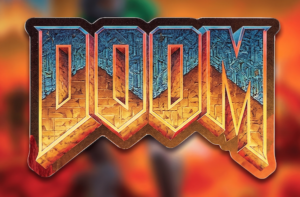

# kitDOOM



**Play Doom, with real graphics and sound, directly inside your terminal.**

***kitdoom runs on terminals that supports the Kitty graphics protocol:
[**Ghostty**](https://ghostty.org/),
[**Kitty**](https://sw.kovidgoyal.net/kitty/),
[**WezTerm**](https://wezterm.net/),
[**cmux**](https://github.com/manaflow-ai/cmux),
[**warp**](https://warp.dev/)***

**Note:** Only "Knee Deep in the Dead" WAD is included in the binary. You can provide your own WAD the `-iwad` flag (see Notes below).


## Install

    cargo install kitdoom

Then just `kitdoom` to play.

---

## Why

- Stop leaving the terminal just to scratch the "one quick level" itch.
- Skip emulator windows, launcher setup, and graphics backends you do not need.
- Keep Doom playable over a terminal workflow with the original framebuffer streamed as Kitty graphics.

---

<!-- ## Show, Don't Tell


-->

## Key Capabilities

- **Instant terminal carnage**: launch Doom from termimal and just start playing.
- **Original pixels, modern pipe**: stream Doom's 640x400 framebuffer through compressed Kitty graphics chunks.
- **Sound included**: bundled effects and music play through the miniaudio bridge with no SDL setup.

---

## Usage


```bash
kitdoom
kitdoom -nosound
kitdoom -iwad /path/to/doom.wad
```

---

## How It Works

```text
doomgeneric C engine -> Rust FFI callbacks -> RGB framebuffer
        -> zlib + base64 Kitty chunks -> terminal
        -> crossterm input + miniaudio sound -> Doom loop
```

`kitdoom` keeps the engine proven and the terminal layer sharp: Rust owns the terminal lifecycle, input, scaling, timing, and Kitty rendering, while the vendored Doom core does what it already does best.

## Notes

This version comes with Doom shareware WAD (doom1.wad), it only has first episode: "Knee-Deep in the Dead".  You can find WAD online, for example: [archive.org](https://archive.org/download/doom-wads), `Ultimate Doom, The.zip` has full game (4 episodes).  To use your own WAD, you can run `kitdoom -iwad /path/to/doom.wad`.